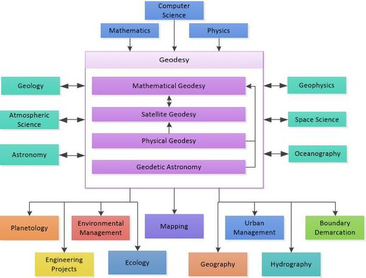

Motivated by one of UNAVCO's videos entitled, "[Do You Call Yourself A Geodesist?](https://www.youtube.com/watch?v=aHC8Q2wyJC8)" I began to wonder, am I a Geodesist? 

__Who is a Geodesist?__

A geodesist measures the Earth's surface as well as studies the science and shape of the planet and gravitational field. Measurements are taken of the size of Earth on a global and regional scale. By taking these measurements of the Earth, crustal shifts and polar movement can be detected. Measurements can determine rate of movement and other pertinent information. A geodesist assigns 3 dimensional points on, above and below the surface of Earth to measure the average depths of oceans, mountain peaks and also abnormalities in the surface of Earth.

__Different core fields of Geodesy:__

_Mathematical_ : relates to three dimensional geometrical elements of the mathematical model of the earth.

_Physical_ : relates to the geophysical internal constitution of the earth to the corresponding gravity field and its observable effects.

_Satellite_ : deals with satellite orbits, tracks existing satellites, and predicts the trajectory of a given missile, satellite, or spacecraft.

_Astronomy_ : chronicles the changing position of stars and other celestial objects. Although listed separately, it overlaps other areas of geodesy and will not be pursued separately here.

__Relationship with Geodesy and other fields:__

_Components of the flowchart were adopted from, Vanicek, Petr, and Edward J. Krakiwsky. Geodesy: the concepts. Elsevier, 2013._