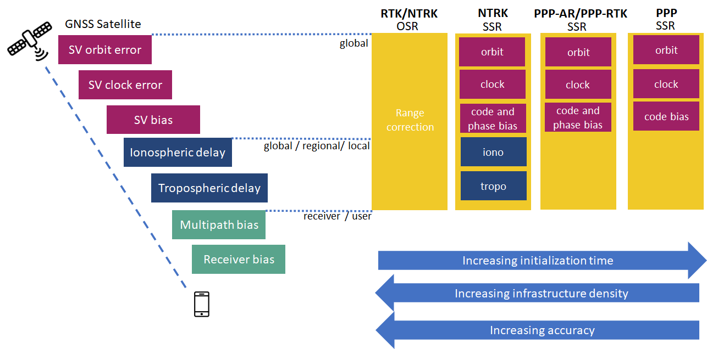
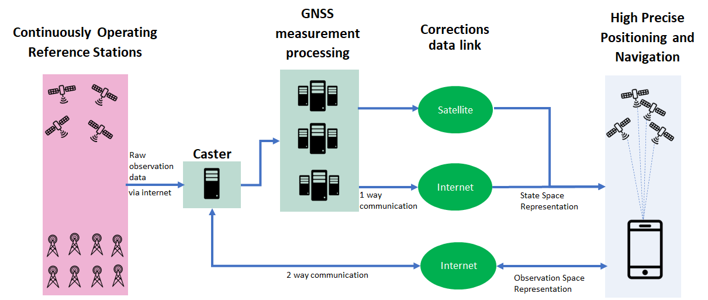

In the last blog post, we looked at the different [GNSS positioning techniques](/post/positioning_techniques/) with a special focus on the metrics accuracy, baseline length and convergence time. If we were to focus on the High Precision Positioning (HPP), the techniques (N)RTK, PPP-AR/PPP-RTK and PPP are brought into the spotlight. As we can see in [Figure 1](#hpp), the core difference centers around what correction information is transmitted to the GNSS receiver.

In (N)RTK, one single lump sum correction is transmitted in the observation domain where as with PPP-related approaches the corrections are transmitted in multiple components in the state space domain. The different domains in which the corrections represent motivated it's naming, Observation Space Representation (OSR) and, State Space Representation (SSR). The primary differences between the techniques and correction representation relates to initialization time, infrastructure requirements and accuracy.

*Figure 1: High Precision Positioning techniques.*

The OSR provides a single compound ranging correction as observed in a nearby (real or virtual) reference station, while in the SSR method, the various error sources are estimated separately by a network of Continuously Operating Reference Stations (CORS) before being sent to the receiver. The requirements of a nearby station in OSR and decorrelation of the error sources in SSR defines the communication channel requirements. In [Figure 2](#ors_vs_ssr), we can appreciate the differences in communication channels possible with SSR in contrast to OSR formatted corrections. With OSR corrections, a two-way communication channel is required to determine the nearest station where as SSR facilitates a one-way dissemination. Another strength of SSR formatted corrections is a significant reduction in bandwidth as corrections are transmitted at a physically meaningful data rate.

*Figure 2: Correction dissemination framework.*

In both long-baseline RTK and PPP processing, it's important to enable (residual) atmopsheric delay estimation. Within the correction information, atmopsheric delays would not be included on long baselines (typically greater than 20 km) and in correction data generated from a sparse global network.

The PPP-AR/PPP-RTK method combines elements from both methods (PPP and RTK) thereby providing a scalable accuracy to all user segments. As SSR corrections have significantly reduced operational cost, this has reshaped the possibilities of mass market high-precision positioning. The emergence of high-accuracy mass market applications shows a strong potential for widespread utilisation of PPP-AR/PPP-RTK.

In our next blog post, [we'll examine if RTK is still relevant in a world dominated by NRTK, PPP-AR/PPP-RTK and PPP](/post/why_rtk/).

<!--  -->

