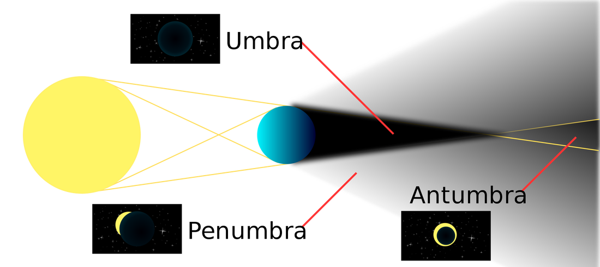
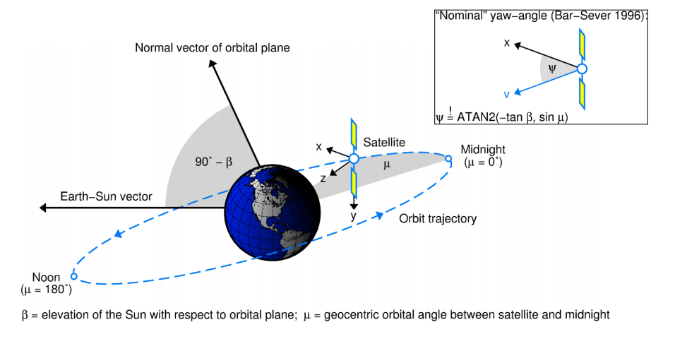
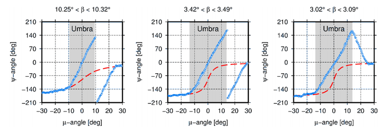
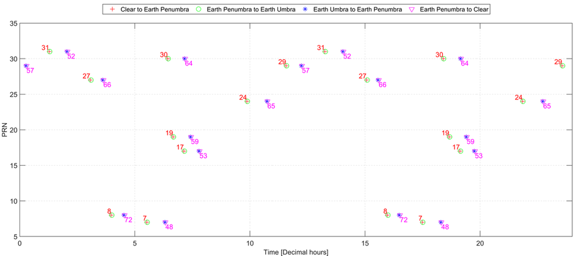
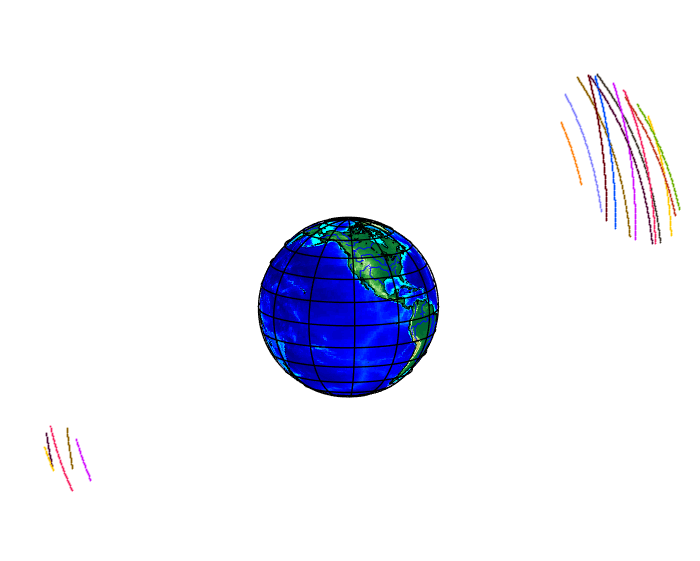

An __eclipse__ is an event that occurs when an object is temporarily obscured, either by passing into the shadow of another body or by having another body pass between it and the viewer.  During an eclipse there are three main phases the object can experience. 

​These phases include:

1. __Umbra__ *(Latin for "shadow")* - The innermost and darkest part of a shadow, where the light source is completely blocked by the occluding body.
2. __Penumbra__ *(from the Latin paene "almost, nearly" and umbra "shadow")* - The region in which only a portion of the light source is obscured by the occluding body. An observer in the penumbra experiences a partial eclipse.
3. __Antumbra__ *(from Latin ante, "before")* - The region from which the occluding body appears entirely contained within the disc of the light source. An observer in this region experiences an annular eclipse, in which a bright ring is visible around the eclipsing body



GNSS satellites has two eclipse seasons per year, each lasting for approximately every seven weeks ([IGS, 2009](http://acc.igs.org/orb-repro1_old.html)). GNSS satellites only experiences an umbra and penumbra. The satellite isn’t far enough from the earth to experience an antumbra. During an eclipse the GPS position quality degrades. A major source of this degradation is the mismodeling of the yaw attitude of those GPS satellites that are in eclipsing orbits. The yaw attitude of GPS satellites is essentially random during an eclipse and for up to 30 minutes past exiting from shadow. Furthermore, commonly used models of the noon turn can be inaccurate for a period of up to 30 minutes. This leads to both measurement and dynamic errors. Errors in the radio metric measurements are introduced because the transmitter phase center and the carrier phase wind-up are mismodeled. This measurement error can be as large as 1 wavelength. Errors in the satellite dynamics are introduced because the direction of the solar pressure force is mismodeled during the 30-minute recovery period after exiting the shadow and during the noon turn (Bar-Server Y, 1994). Therefore, when the satellite enters an eclipse, the solar radiation pressure is zero (umbra) or changing (penumbra), thermal re-radiation force changes as S/C temperature drops down and dolar sensors can no longer control the attitude

## Effects eclipses on GNSS satellites

Most software packages have modeled GPS attitude as follows: a spacecraft - fixed coordinate system is defined where the Z axis is along the navigation antenna boresight, the Y axis is along the solar panel boom and the X axis completes a right hand system. This system is oriented such that the Z axis points at the geocenter, the Y axis is perpendicular to the s/c - Sun vector and X forms a sharp angle with the s/c - Sun vector (i.e. points in the general direction of the Sun). The "yaw angle" is defined as the angle between the s/c-fixed X axis and the orbit plane along the direction of the s/c velocity  (Bar-Server Y, 1994)​.

It is true that GPS satellites keep this nominal orientation outside eclipse seasons. During eclipse season, though, the satellites deviate significantly from this attitude model. This is due to the design of the satellite control subsystem. During shadow events the signal from the Sun sensors vanishes.



The unit that converts the analog Sun sensor signal into digital representation lacks the ability to represent zero voltage. The quantization error is large enough to drive the satellite at full yaw rate and the actual output is determined by the noise in the system. Typically, a satellite will start yawing at full rate upon entering shadow. At maximum yaw rate of about 0.12 degrees/second the satellite can yaw more than 360 degrees during a 50-minute long shadow event. Upon exit it will find itself 180 degrees in yaw error (since the nominal yaw attitude can change by as much as 180 degrees during shadow). The satellite will need half an hour to correct for that error. Neither the direction of the yaw during shadow, nor the magnitude of the yaw itself are predictable. Satellites have been observed to oscillate in yaw, freeze and switch direction of full yaw. The mismodeling during the noon turn is milder. Most software packages simply ignore the natural limits on the yaw rate. Because the satellite yaw rate is limited, its actual yaw attitude will lag behind the ideal yaw attitude for orbits with small beta angle (beta < 5 degrees) during noon turns. The mismodeling during shadow and during noon combine to degrade any navigation solution. The level of degradation depends on the number of satellites in eclipse, the beta angle, and the random behavior of the satellites during shadow  (Bar-Server Y, 1994).

Presented in the following figure is the yaw-angle and yaw-rate as the satellite travels from a penumbra to an umbra, then returns into a penumbra.​


​Source: [Dilssner F. et al, 2012b](https://www.nav.ei.tum.de/fileadmin/w00bkq/www/Colloquium/colloquium_dilssner_slides.pdf])

## Data on GPS eclipses

As a component of other research on GPS orbit and clock information, I needed to know when satellites had an increase in yaw-rate, which, as previously discussed, occur during an eclipse and at noon. Presented in the figure below, are the stages of a satellite eclipses in 2015 DOY 361. The data was obtained from [JPL's data archive](ftp://sideshow.jpl.nasa.gov/pub/JPL_GPS_Products/Final/2015/). The “.shad” files provides the information with respect to the GPS serial number (subscript). Using the IGS ANTEX file I found the respective PRN (superscript). One of the limitations of the ​“.shad” files were, it didn't include when the satellite was in a noon position.



## Detecting an eclipse

To detect if a satellite is at noon or night position, the angle between the sun and satellite is computed. If the angle between the sun and satellite is within +/- 5.7 deg, the satellite is in a noon position and if angle is within +/- 14.5 deg, the satellite is in a night position. An eclipse is flagged when the angle is less than 0 deg. Presented is the computation in MATLAB syntax.

```matlab
%% Input Data
% satellitePosition - Satellite position
% sunPosition - Sun position

%% Output Data
eclipseCondition = 0;
noonTrueFalse 	 = false;
nightTrueFalse 	 = false;

% Constants
%SV at noon: angle between sun and sv radius vectors +/- 5.7 deg cos(+-5.7 deg)= .995
noonDegrees      = 5.7; 
%SV in shadow: angle between sun and sv radius vectors +/- 14.5 deg  cos(180+-14.5 deg)= -.968
nightDegrees     = 180+14.5;  

%% Computation
satelliteRadius  = norm(satellitePosition);
sumRadius        = norm(sunPosition);
satelliteAngleRadians   = dot(satellitePosition,sunPosition)/satelliteRadius/sumRadius;

noonRadians 	= cos(degtorad(noonDegrees));
nightRadians	= cos(degtorad(nightDegrees));

if (satelliteAngleRadians < nightRadians)
    nightTrueFalse = true;
end

if (satelliteAngleRadians > noonRadians) 
    noonTrueFalse = true;
end

if (noonTrueFalse || nightTrueFalse)
    if (satelliteAngleRadians < 0)
        eclipseCondition=1; %Night Shadow
    else
        eclipseCondition=2; %Noon Turn
    end
end
```

The following results are based on the previously described algorithm. 24 hours of orbital data was used from 2015 DOY 361. We can easily see when satellites entered a noon position (lower left) and a night position (upper right).




