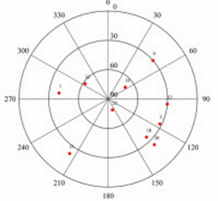

Sky plots are polar orthogonal plots illustrating the satellite's path as a function of elevation and azimuth which can be used in GNSS survey planning. Sky plots illustrates the geometry of the satellite constellation which is expressed mathematically as the geometric dilution of precision (GDOP) factor,

Presented, is the matlab code used to generate the figure on left using data from the reference station ALGO on DOY 62 2008 at 12:00 GPS Time. The azimuth and elevation angle is assumed known.




```c
rad2deg=180/pi;
deg2rad=pi/180;

%% Satellite Information
prn=[14,18,1,9,12,30,22,32,5,31];               %Satellite PRN
azi=[55,135.2,-83,49,95,135,159,-56,116,-145];  %Azimuth in degrees
el=[69,35,40,30,30,24,78,62,32,22];             %Elevation angle in degrees

%% Plot Figure
a=azi*deg2rad;                                  %Convert degrees to radians
r=90-el;                                        %Convert elevation angle to zenith

for i=1:size(azi,2), 
    svx(i)=r(i)*cos(a(i))  ; svy(i)=r(i)*sin(a(i)); %Calculate polar co-ordinates
end
polarhg([30 60])                                %Prerequisite script used to format axis
hold on
plot( svx,svy,'.r','markers',20);               %Plot satellite location
hold off

%% Format output 
for i=1:R,
    text(svx(i)+7,svy(i),num2str(prn(i)), 'FontSize' ,10) ; %Add PRN labels to each point
end

axis('square')
grid on;  
set(gcf, 'Color', 'w');                        %Change background of figure from grey to white
ti = get(gca,'TightInset')   ;                 %Remove extra spacing around figure
set(gca, 'LooseInset', [0,0,0,0.01]);          %Depending on the figure, you may need to add extra
                                               %spacing [left bottom width height])
print( '-dtiff',  ['skyPlot'], '-r600');       %Change "-r600" to the required DPI

```

To run the script above, the script polarhg is required, which can be downloaded [here](./polarhg.m).