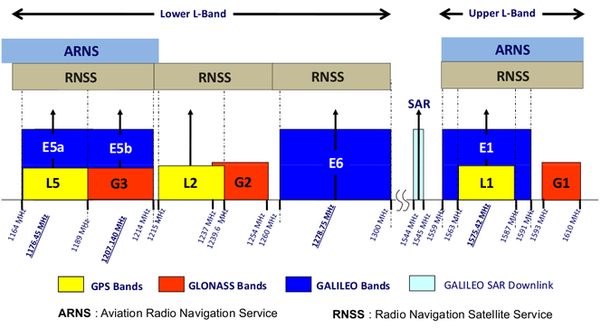

The L band, as defined by the IEEE (Institute of Electrical and Electronics Engineers), is the 1 to 2 GHz range of the radio spectrum. The L band consists of two components, Aviation Radio Navigation Service (ARNS) and Radio Navigation Satellite Service (RNSS) and is utilized in many radar, satellite and terrestrial communications applications.

The L band has several advantages which marks it suitable for GNSSs. The L band has a low bandwidth due to its low frequency range. As a result, it is not suitable for streaming applications like video, voice and broadband connectivity. The L band waves penetrate clouds, fog, rain, storms, and vegetation, GNSS receivers can track the L Band signal in most weather conditions. The primary limitation of the L band signal is its inability to penetrate solid objects such as concrete buildings.

The GNSS carrier frequency to transport the data signals were required to meet the following requirements:
* Frequencies should be below 2 GHz, as frequencies above 2 GHz would require beam antennae for the signal reception.
* Ionospheric delays are significant for frequency below 1,000 MHz and above 10 GHz.
* PRN codes require a high bandwidth for code modulation on the carrier frequency. Therefore, a range of high frequencies with the possibility of a high bandwidth had to be chosen.
* Selected frequency should be in a range where the signal propagation is not influenced by weather phenomena like rain, snow, or clouds.

