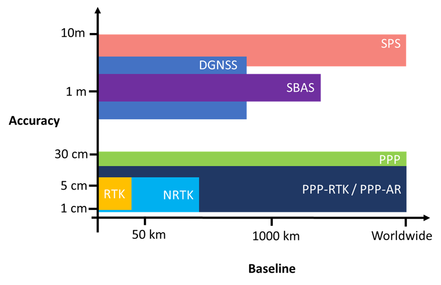
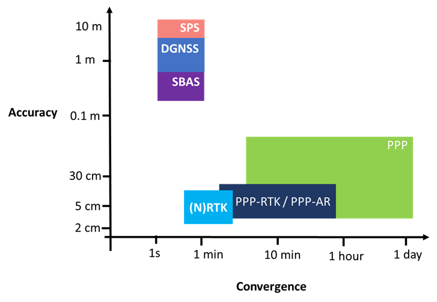

When utilizing GNSS measurements to calculate the receiver/user's position, there are several different positioning techniques. These positioning techniques include SPS, DGNSS, SBAS, PPP, PPP-RTK/PPP-AR and (N)RTK. Each of the different positioning techniques offers different levels of position accuracy as described in the [Figure 1](#accuracy_vs_baseline). The fundamental difference between the positioning techniques is due to the source of the correction data which you can [read more about here](/post/augmentation_representation/).

Applications which require metre-level accuracy with limited processing power would adopt positioning strategies such as SPP, DGNSS and SBAS. Applications which require decimetre-level accuracy will adopt high precision strategies such as PPP, PPP-AR/PPP-RTK and (N)RTK. All of the positioning techniques mentioned allows for multi-GNSS constellation and multi-GNSS frequency processing. Processing of multi-GNSS constellation and multi-GNSS restricted to the hardware limitations of the GNSS receiver as well as the correction availability. The accuracy of (N)RTK processing is typically limited by the baseline length as presented in [Figure 2](#accuracy_vs_convergence). RTK can reliably attain cm-level accuracy within 20 km where as NRTK is limited to the local network infrastructure and can enable positioning with baselines up to 75 km. PPP techniques is less sensitive to baseline length due to the format of the correction data, as such, it’s referred to a global positioning technique.

*Figure 1: Comparison of positioning accuracies provided by SPS, DGNSS, PPP and RTK methods. It should be noted that the positioning accuracies provided by some positioning techniques such as DGNSS and RTK are a function of baseline length.*

Techniques such as SPS, DGNSS and SBAS typically advertise instantaneous convergence due to their more relaxed accuracy requirements, typically at the metre-level. While PPP is attractive due its ability to provide a precise position estimate globally, it does come with a caveat in terms of convergence time. Convergence time is a function of the accuracy requirements of the user’s application [Figure 2](#accuracy_vs_convergence). For marine applications such as navigation in ocean and coastal regions, PPP provides instantaneous convergence in environments where RTK and NRTK would be unavailable. Whereas in Rail for specific applications such as positioning of machines and infrastructure surveys PPP will take 10’s of minutes to a few hours to attain convergence.

*Figure 2: Comparison of positioning accuracies and convergence time provided by SPS, DGNSS, PPP and RTK methods. It should be noted that the positioning accuracies provided by some positioning techniques such as DGNSS and RTK are a function of baseline length.*

In addition to accuracy, baseline length and convergence there are several other criteria which should be considered when comparing the different GNSS position computation strategies.  These factors include, available observables, reference frame, communication link, multi-frequency, correction representation and bandwidth.