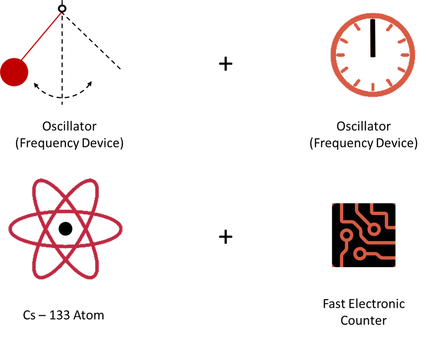
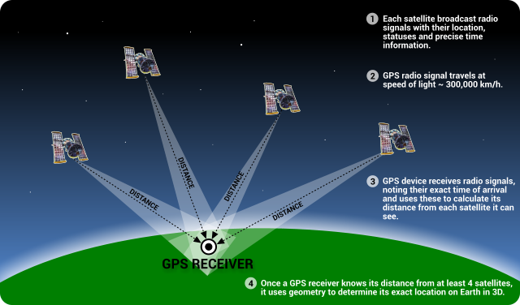

Recently, my research has shifted away from GNSS positioning and more towards clocks. I’ve been examining different products for correcting satellite clock errors and different strategies for combining the products. Looking at the variations in the GNSS timing system, a timing system some people would describe as an absolute measure of time, motivated the question, “What is time?”. 

Time, measured by a clock, may be considered as a two-part device. A clock will have an oscillating device for determining the length of the second. Historically, the pendulum was the classic source of time interval. Currently, the typical wristwatch, has as its frequency standard, a quartz-crystal tuning fork with an oscillation frequency of 32,768 Hertz (hz) where Hertz represents the number of cycles per second. ​

​Compared to the pendulum or quartz crystal oscillator, atomic clocks provide a much more accurate frequency.

The current official definition of the second is much more elegant and was agreed upon in 1967. It is based on the simple equation, E = hn. The energy difference is specific to a particular quantum transition in the cesium-133 atom, whose unperturbed frequency has been defined as 9,192,631,770 Hz. When the defined number of cycles transpire for the electromagnetic signal associated with the photon either being given off or absorbed by this quantum transition, we have one official second.

The second part of a clock is the counter that keeps track of the number of seconds or clock cycles that have occurred. This part of the clock is represented by the gears and clock face in a pendulum clock. It keeps track of hours, minutes, and seconds. After being set initially, the clock can then provide its estimate of the correct time by adding up the number of clock cycles.
​
In principle, if a clock were set perfectly and if its frequency or rate remained perfect, it would keep the correct time indefinitely. In practice, this is impossible for several reasons: the clock cannot be set perfectly; random and systematic variations are intrinsic to any oscillator, and when these random variations are averaged, the result is often not well-behaved; time is a function of position and motion (relativistic effects); and lastly and invariably, environmental changes cause the clock’s frequency to vary from ideal.

# How does time relate to GPS positioning?

The Global Positioning System (GPS) is a classic example of using precise timing for accurate positioning. Many navigation systems predating GPS also used atomic clocks, but they were ground-based. GPS features a constellation of orbiting satellites, each with a synchronized atomic clock on board. It effectively puts a super-accurate clock in the sky for everyone to see with the eyes of modern technology. At any given time and at any point on Earth, at least four of these satellites can be seen. A precise timing device in a GPS receiver is used by its computer to calculate the time of flight of the signal from each of the observable satellites. Since the signals travel at the velocity of light, and this is known exactly, the receiver’s computer can turn the time of flight into a very accurate estimate of the distance to each satellite — accounting for some delays in both the neutral and ionized parts of the atmosphere. GPS satellites also broadcast their positions. Information received from four satellites yields four equations which can be solved for four unknowns: latitude, longitude, altitude, and GPS-system time. In this process, the high accuracy of the GPS atomic clocks is transferred to the precision quartz-crystal clock inside the receiver. Therefore, high accuracy position and time are readily available.

